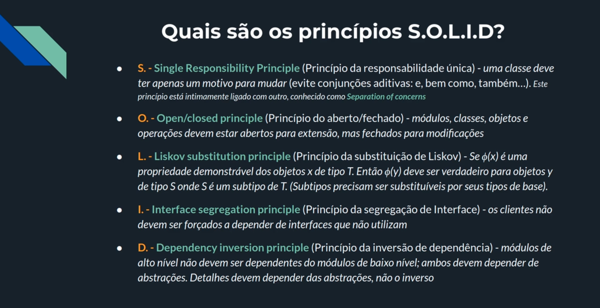

# Solid principles

**Tip:** Develop the project as you know it, then continue refactoring according to SOLID principles.

- **Single Responsibility Principle** (1_srp)
- **OpenClosed Principle** (2_ocp)
- **Liskov Substitution Principle** (3_lsp)
- **Interface Segregation Principle** (4_isp)
- **Dependency Inversion Principle** (5_dip)

## Projets paths

The project was developed according to a Udemy course, the project was originally in the '0_legacy' path without SOLID principles, then it was refactored using principle for principle.
